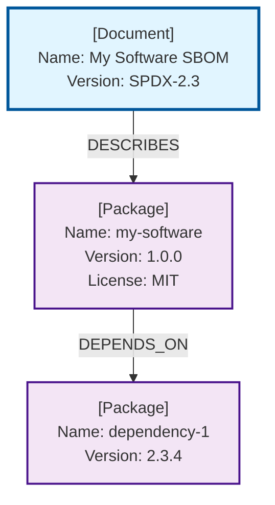

# SPDX to Mermaid Converter

A Python tool that converts SPDX (Software Package Data Exchange) files into Mermaid tree diagrams. Visualizes packages, files, relationships, and metadata from SPDX documents.

## Features

- **Comprehensive visualization** of SPDX elements: packages, files, snippets, and relationships
- **Multi-format support**: JSON, YAML, XML, RDF, and tag-value formats
- **Color-coded nodes**: Documents (blue), Packages (purple), Files (green), Snippets (orange)
- Shows versions, licenses, checksums, suppliers, and dependencies

## Installation

Clone the repository:

```bash
git clone <repository-url>
cd spdx-to-mermaid
```

The project uses [Flox](https://flox.dev) for the development environment and [uv](https://docs.astral.sh/uv/) for Python dependency management. Dependencies are automatically managed when using `uv run`.

## Two Environments

This repository contains two Flox environments:

### 1. Development Environment (root)
- **Location**: Repository root
- **Purpose**: Development, building, and publishing the package
- **Includes**: Python source, build tools, uv, testing tools
- **Usage**: Clone this repo to develop or publish the package

### 2. Viewer Environment (spdx-viewer/)
- **Location**: `spdx-viewer/` subdirectory
- **Purpose**: Standalone visualization environment
- **Includes**: Published `spdx-to-mermaid` package, mermaid-cli, chromium, HTTP server
- **Usage**: Can be pushed to FloxHub and shared with teams
- **Lightweight**: No build tools or source code, just the published package

See [spdx-viewer/README.md](spdx-viewer/README.md) for details on using the viewer environment.

## Usage

### Quick Visualization

The fastest way to visualize an SPDX file is using the included `just` command, which converts the diagram to SVG and opens it in Chrome:

```bash
flox activate -- just show git-2.51.2.spdx.json
```

This automatically converts the SPDX file to a Mermaid diagram, renders it as SVG using `mmdc`, and opens it in Google Chrome.

### Basic Usage

Convert an SPDX file and output to stdout:

```bash
flox activate -- uv run spdx-to-mermaid git-2.51.2.spdx.json
```

### Save to File

Save the generated Mermaid diagram to a markdown file:

```bash
flox activate -- uv run spdx-to-mermaid git-2.51.2.spdx.json -o diagram.md
```

### Examples

```bash
# Convert SPDX file to markdown
flox activate -- uv run spdx-to-mermaid package.spdx.json -o diagram.md

# View output directly
flox activate -- uv run spdx-to-mermaid sbom.spdx.yaml | less

# Convert different formats
flox activate -- uv run spdx-to-mermaid software.spdx.xml -o output.md
```

### Command-Line Options

```
usage: spdx_to_mermaid.py [-h] [-o OUTPUT] spdx_file

positional arguments:
  spdx_file             Path to the SPDX file (JSON, YAML, XML, RDF, or tag-value)

options:
  -h, --help            Show help message
  -o OUTPUT, --output OUTPUT
                        Output markdown file (default: stdout)
```

## Output Format

The tool generates a Mermaid diagram showing:

1. **Document info**: Name, SPDX version, creation date, creators, namespace
2. **Package details**: Name, version, download location, license, checksums, supplier
3. **File info**: Name, license, copyright, checksums
4. **Snippets**: License, copyright information
5. **Relationships**: Visual arrows showing dependencies (DEPENDS_ON, DESCRIBES, etc.)
6. **Legend**: Color-coded node type reference

## Viewing Diagrams

View the generated markdown files in:

- **GitHub/GitLab**: Native Mermaid rendering
- **VSCode**: Install "Markdown Preview Mermaid Support" extension
- **Mermaid Live Editor**: https://mermaid.live
- **Documentation sites**: MkDocs, Hugo, etc.

## Example Output



## References

- [SPDX Specification](https://spdx.github.io/spdx-spec/)
- [Mermaid Documentation](https://mermaid.js.org/)
- [Mermaid Live Editor](https://mermaid.live)
